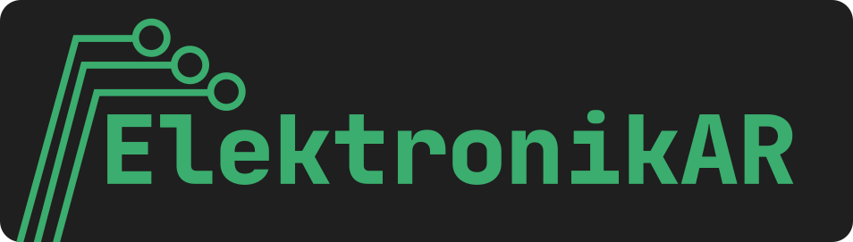

# ElektronikAR

Proyecto final para la materia "Temas Selectos de Ingeniería en Computación III: Realidad Aumentada y Realidad Virtual"

## Documentación

[Manual técnico](./docs/TechManual.md)

[Manual de usuario](./docs/UserManual.md)

[Análisis de viabilidad y costos](./docs/FeasibilityAnalysis.md)

[Demo de funcionamiento](https://youtube.com/shorts/4_kVw50ruT0?feature=share)

>[!NOTE]
>La documentación en formato PDF y el archivo APK de la aplicación se encuentran en el apartado **Releases**.

## Temática a implementar
La electrónica es una disciplina clave en la formación en el área de la ingeniería, principalmente aquellas relacionadas al área eléctrica. Sin embargo, los estudiantes principiantes pueden enfrentar dificultades para identificar componentes, comprender conexiones y realizar montajes básicos.
Esta aplicación tiene el objetivo de ayudar a comprender y conocer los diversos componentes electrónicos que un estudiante en ingeniería puede llegar a utilizar, desde piezas simples como resistencias, capacitores o switches, hasta tarjetas y microcontroladores que se llegan a utilizar, como Arduino UNO, ESP32 Altera DE10 Lite o Raspberry PI.

## Propuesta de implementación
El proyecto a realizar será una aplicación de realidad aumentada para dispositivos móviles, que incluye las siguientes funcionalidades:
- **Modo informativo / visualización**: Permite observar modelos 3D detallados de los componentes electrónicos, mostrando conexiones, las localidades de sus puertos e información de estos, algunas funciones, y su información detallada de una manera interactiva.
- **Modo de conexión**: Permite simular conexiones entre los componentes, por ejemplo, al tener en un marcador un Arduino y en otro un sensor, mostrar los pines en el que se pueden conectar estos elementos y permitir al usuario realizar esta conexión.

Este proyecto tiene la siguiente justificación:
- Promover el aprendizaje visual e interactivo.
- Pruebas sencillas sin necesidad de hardware real.
- Ideal para cursos de introducción o enseñanza remota.
