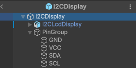

# Manual Técnico: ElektronikAR

# Resúmen general

El proyecto contempla los elementos descritos en el alcance del documento de propuesta, la aplicación permite realizar conexiones entre los componentes electrónicos, presentando también algunas animaciones para algunos elementos. También se tiene un menú para administrar las conexiones, listado de los pines por elemento que se muestra al presionar un componente electrónico, y una pantalla con información general del componente.  
La aplicación cuenta con los siguientes modelos:

* Arduino UNO  
* ESP32  
* Pantalla LCD I²C  
* Servomotor SG90  
* Sensor ultrasónico HC-SR04

Los paneles (o menús) que incluye son los siguientes:

* **Interfaz principal**: Incluye los botones para reiniciar, cambio entre modo de conexión y modo de información, botón para agregar conexión, panel para información al conectar y botón para ver todas las conexiones activas en el escenario mediante líneas.  
* **Listado de pines**: Se muestra al seleccionar uno de los componentes electrónicos, este muestra cada pin con su nombre y modos de operación, así como se muestra un botón para seleccionarlo.  
* **Listado de conexiones**: Se abre mediante un botón lateral en la parte superior, en este panel se muestran las conexiones activas con la información de los dispositivos y cada pin que se utilizan, un color que los distingue en el escenario tanto en los marcadores sobre cada pin, botón para eliminar la conexión y botón para mostrar la conexión en el escenario mediante una línea.

# Cronograma de actividades

Respecto al cronograma establecido en la propuesta, este tuvo varios cambios.  

## Propuesta del proyecto

Esta tarea marca el punto de partida. Se lleva a cabo del 6 al 12 de abril de 2025 (7 días). Durante esta etapa se definió el enfoque del proyecto, se identificaron los objetivos, la metodología de trabajo, herramientas a utilizar y la viabilidad técnica del sistema de realidad aumentada.

## Desarrollo

Esta sección se puede dividir en dos partes ya que se llevaron prácticamente en paralelo.

### Modelado 3D y texturizado

Inicia el 13 de abril y se extiende por 25 días, hasta el 7 de mayo de 2025\. Aquí se crean y optimizan los modelos tridimensionales necesarios para la aplicación de realidad aumentada.

### Desarrollo de la aplicación

Comienza el 16 de abril y dura 29 días, finalizando el 15 de mayo de 2025\. En esta etapa se implementa la lógica de la aplicación en Unity, la integración con Vuforia, los sistemas de interacción y la interfaz de usuario. También se establecen los flujos educativos, la validación de conexiones y cualquier funcionalidad interactiva del sistema.

## Pruebas de funcionamiento

Esta tarea se realiza justo después de terminar el desarrollo de la aplicación, el 16 de mayo de 2025, con una duración de 1 día. Se validan funcionalidades clave como la detección de marcadores, la visualización de modelos, la interacción de pines, así como la estabilidad general de la aplicación.

## Documentación

También programada para el 15 de mayo, justo después del desarrollo, con una duración de 1 día. Incluye la redacción del informe final, manual de usuario y manual técnico. Es esencial para sustentar técnicamente el proyecto y facilitar su mantenimiento o futura expansión.

# Estructura del proyecto

El proyecto tiene la siguiente estructura:

* **Animations**: Contiene los controladores de animación y cada una de las animaciones de los paneles, y en particular las animaciones para el modelo del servomotor.  
* **Editor**: Adicional a algunos elementos de Vuforia, se tiene un componente de interfaz para seleccionar los pines automáticamente en cada componente.  
* **Electronics**: Almacena la información de cada componente en distintos *ScriptableObject*.  
* **Logo**: Archivos del logo de la aplicación.  
* **Materials**: Almacena algunos materiales necesarios para los objetos.  
* **Models**: Almacena todos los modelos de componentes electrónicos.  
* **Prefabs**: Contiene los componentes electrónicos ya configurados para Unity y algunos elementos de la interfaz.  
* **Scripts**: Contiene todos los scripts para la interacción de la aplicación. Definen acciones específicas al conectar pines entre componentes. Incluyen:  
  * IComponentAction.cs: Interfaz base para acciones personalizadas.  
  * ComponentAnimate.cs, ComponentChangeMaterial.cs: Implementaciones de acciones visuales como animación o cambio de color.  
  * ComponentInfo.cs, ComponentInfoManager.cs: Información y gestión de metadatos de componentes electrónicos.  
  * ElectronicComponent.cs: Clase base de los componentes electrónicos.  
  * GpioPin.cs: Define los pines, sus tipos y compatibilidades.  
  * PinConnection.cs, PinConnectionManager.cs: Lógica de conexión entre pines  
  * ConnectionsUI.cs, PinSelectorUI.cs, PinLabelUI.cs: Scripts relacionados con la interfaz gráfica para seleccionar y visualizar conexiones.  
  * MainMenuActions.cs, MenuInfoController.cs: Controlan navegación y acciones del menú principal.  
  * ComponentInterfaceType.cs, ComponentType.cs, PinType.cs: Definen tipos y categorizaciones para lógica de validación.  
* **Textures**: Contiene texturas para los elementos y algunos sprites para la interfaz.

# Tecnologías usadas

Para este proyecto se utilizó Unity para el desarrollo con el plugin de Vuforia, ya que este agiliza el desarrollo aplicaciones de Realidad Aumentada.  
Para la generación de los contenidos se utilizó Blender para el modelado 3D e Inkscape para la creación de las texturas y algunos iconos.

# Procedimientos

## Creación de un componente electrónico

Para crear un componente electrónico es necesario tener su modelo, en Unity se crea con la siguiente estructura:

* **GameObject vacío**: Utiliza el componente *Electronic Component*, un *Box Collider*, y opcionalmente un *IComponentAction* que se utiliza si tiene habilitada la opción *Can Be Activated* del primer componente.  
  * **Modelo 3D del componente**  
  * **PinGroup**: Componente vacío que se utiliza para agrupar los pines.  
    * **Listado de objetos con el componente *GpioPin***: Representan los pines y en el escenario se colocan en la posición al que corresponden en el modelo.

El componente *ElectronicComponent* incorpora un botón en su configuración que permite escanear todos los *GameObject* que utilicen el componente *GpioPin* y tener un registro de estos.

## Conexión entre componentes

La conexión se realiza mediante una instancia global *PinConnectionManager*, la cual se encarga de conectar dos puntos distintos entre componentes,  así como las animaciones o mensajes que se muestran en pantalla al conectar. De igual forma, la validación de las conexiones se realiza en esta instancia.

## Visualización de la conexión

Para mostrar la conexión se utiliza el método *ShowConnection* de la clase *PinConnectionManager*, el cual instancia un *GameObject* con un *LineRenderer* y un *ConnectionLine*, que es un componente que actualiza los puntos de anclaje entre los componentes cada que cambian su posición. Esta instancia se destruye automáticamente después de 5 segundos.

## Animación de los componentes

Hay algunos componentes que se pueden animar al conectarlos, por ejemplo la pantalla I2C, que cambia su textura; o el servomotor, que mueve su eje. Para tener una estructura general de cómo deben ser las clases para las animaciones se cuenta con la interfaz *IComponentAction*, que define los métodos *OnValidConnection* y *OnInvalidConnection*, y esta la implementan los componentes *ComponentChangeMaterial* para el cambio de texturas, y *ComponentAnimate* para activar una animación.

# Recursos adicionales

* Simple Free Pixel Art Styled UI Pack: [Unity Asset Store](https://assetstore.unity.com/packages/2d/gui/icons/simple-free-pixel-art-styled-ui-pack-165012)
