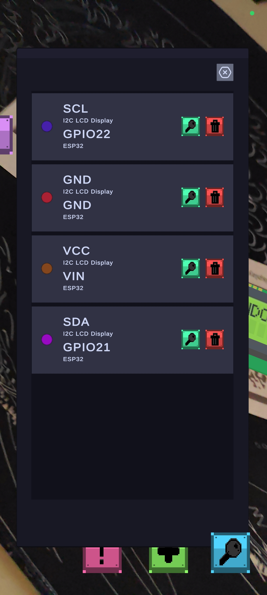

# Manual de Usuario: ElektronikAR

# Resúmen general

ElektronikAR es una aplicación educativa para simular la conexión entre componentes electrónicos comúnmente utilizados
en el ámbito de la ingeniería, de una manera interactiva mediante el uso de la **Realidad Aumentada**.

# Uso del programa

Para mostrar un componente electrónico, es necesario colocar en una superficie alguno de los marcadores disponibles para
esta aplicación.

## Modo de conexión

Este es el modo por defecto al iniciar la aplicación, en este modo se pueden realizar conexiones entre los componentes.
Para abrir el menú de puntos de conexión, se debe de presionar sobre alguno de los modelos 3D que se muestren en
pantalla, posteriormente se abrirá un menú con el listado de pines del componente, mostrando su nombre y diferentes
tipos, para seleccionar uno se puede presionar el botón que está a un lado de la información.

## Modo de información

El modo de información permite mostrar una ventana con la información relevante de un componente electrónico. Para
entrar en este modo se debe de seleccionar el botón rojo de la parte inferior con el signo de exclamación, este cambiará
de ícono y habilitará el modo de información, para regresar al modo de conexión se debe de presionar nuevamente.

|            Modo de conexión             |         Modo de información         |
|:---------------------------------------:|:-----------------------------------:|
|  |  |

## Realizar una conexión

Para realizar una conexión es necesario estar en el modo de conexión y tener al menos dos componentes electrónicos en la
escena, se debe de presionar sobre alguno de estos, seleccionar el pin del primer componente, seleccionar el otro
componente y seleccionar un pin que sea compatible con este. Posteriormente en la parte inferior de la pantalla se
mostrará un panel con los componentes seleccionados, se pueden eliminar seleccionando el ícono de la papelera, o crear
la conexión seleccionando el botón de color verde con el signo ‘+’ en la parte inferior.

## Menú de conexiones creadas

Al presionar el botón morado de la parte superior se muestra un panel con las conexiones creadas en la escena, desde
este panel se puede ver la información de la conexión, y cuenta con dos botones: uno para ver una línea entre los puntos
en los modelos de la escena; y otro para eliminar la conexión.

## Ver todas las conexiones activas

Para ver todas las conexiones creadas, se selecciona el botón de la parte inferior con el ícono de lupa.

## Activar un componente

Para activar un componente de tipo sensor, actuador o display se deben de conectar todos los pines a un componente de
tipo microcontrolador, con el cual se podrán activar estos componentes.

|           Realizar una conexión            |          Menú de conexiones creadas          |
|:------------------------------------------:|:--------------------------------------------:|
|  |  |

|         Activación de un componente         | Comparativa con los componentes reales |
|:-------------------------------------------:|:--------------------------------------:|
|  |   |

## Reinicio del programa

Para reiniciar el programa, se selecciona el botón amarillo con el símbolo de reinicio, en la parte inferior. Esto
eliminará todas las conexiones en escena y reiniciará el estado de todos los componentes.

# Marcadores

|      |       |
|:----------------------------------:|:---------------------------------:|
|   |  |
|  |                                   |